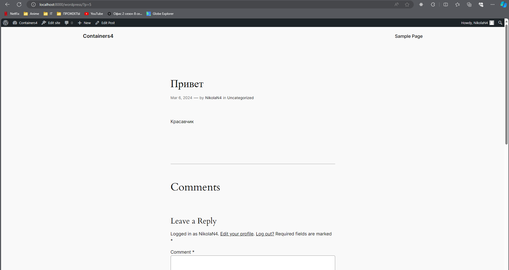

Лабораторная работа №4: Запуск сайта в контейнере
=================================================

Цель работы
-----------

Выполнив данную работу студент сможет подготовить образ контейнера для запуска веб-сайта на базе Apache HTTP Server + PHP (mod_php) + MariaDB.

Задание
-------

1.  Создать Dockerfile для сборки образа контейнера, который будет содержать веб-сайт на базе Apache HTTP Server + PHP (mod_php) + MariaDB. База данных MariaDB должна храниться в монтируемом томе. Сервер должен быть доступен по порту 8000.
2.  Установить сайт WordPress. Проверить работоспособность сайта.

Подготовка
----------

Для выполнения данной работы необходимо иметь установленный на компьютере Docker. Также необходим опыт выполнения лабораторной работы №3.

Выполнение
----------

1.  Создайте репозиторий `containers04` и скопируйте его себе на компьютер.

2.  Извлеките конфигурационные файлы `apache2`, `php`, `mariadb` из контейнера.

3.  Создайте в папке `containers04` папку `files`, а также папку `files/apache2`, `files/php`, `files/mariadb`.

4.  Создайте в папке `containers04` файл `Dockerfile` с указанным содержимым.

      ```dockerfile
    # create from debian image
    FROM debian:latest

    # install apache2, php, mod_php for apache2, php-mysql and mariadb
    RUN apt-get update &&\
    apt-get install -y apache2 php libapache2-mod-php php-mysql mariadb-server &&\
    apt-get clean`
      ```

5.  Постройте образ контейнера с именем `apache2-php-mariadb`.

6.  Создайте контейнер `apache2-php-mariadb` из образа `apache2-php-mariadb` и запустите его в фоновом режиме с командой запуска `bash`.

7.  Скопируйте из контейнера файлы конфигурации `apache2`, `php`, `mariadb` в папку `files/` на компьютере.

    ```bash
    docker cp apache2-php-mariadb:/etc/apache2/sites-available/000-default.conf files/apache2/
    docker cp apache2-php-mariadb:/etc/apache2/apache2.conf files/apache2/
    docker cp apache2-php-mariadb:/etc/php/8.2/apache2/php.ini files/php/
    docker cp apache2-php-mariadb:/etc/mysql/mariadb.conf.d/50-server.cnf files/mariadb/
    ```

8.  Остановите и удалите контейнер `apache2-php-mariadb`.

Настройка конфигурационных файлов
---------------------------------

1.  Конфигурационный файл `apache2`:

   -   Откройте файл `files/apache2/000-default.conf`, найдите строку `#ServerName www.example.com` и замените её на `ServerName localhost`.

   -   Найдите строку `ServerAdmin webmaster@localhost` и замените в ней почтовый адрес на свой.

   -   После строки `DocumentRoot /var/www/html` добавьте следующие строки:

       Copy code

       `DirectoryIndex index.php index.html`

   -   В конце файла `files/apache2/apache2.conf` добавьте строку:

       Copy code

       `ServerName localhost`

2.  Конфигурационный файл `php`:

   -   Откройте файл `files/php/php.ini`, найдите строку `;error_log = php_errors.log` и замените её на `error_log = /var/log/php_errors.log`.

   -   Настройте параметры `memory_limit`, `upload_max_filesize`, `post_max_size` и `max_execution_time` следующим образом:
 
```makefile
memory_limit = 128M
upload_max_filesize = 128M
post_max_size = 128M
max_execution_time = 120
```

3.  Конфигурационный файл `mariadb`:

   -   Откройте файл `files/mariadb/50-server.cnf`, найдите строку `#log_error = /var/log/mysql/error.log` и раскомментируйте её.

Создание скрипта запуска
------------------------

1.  Создайте в папке `files` папку `supervisor` и файл `supervisord.conf` со следующим содержимым:

    confCopy code
```editorconfig
[supervisord]
nodaemon = true
logfile = /dev/null
user = root

# apache2
[program:apache2]
command = /usr/sbin/apache2ctl -D FOREGROUND
autostart = true
autorestart = true
startretries = 3
stderr_logfile = /proc/self/fd/2
user = root

# mariadb
[program:mariadb]
command =
/usr/sbin/mariadbd --user = mysql
autostart = true
autorestart = true
startretries = 3
stderr_logfile = /proc/self/fd/2
user = mysql
```

Создание Dockerfile
-------------------

1.  Откройте файл `Dockerfile` и добавьте в него следующие строки:

```dockerfile
# mount volume for mysql data
VOLUME /var/lib/mysql

# mount volume for logs
VOLUME /var/log

# install supervisor package
RUN apt-get update && apt-get install -y supervisor && apt-get clean

# add wordpress files to /var/www/html
ADD https://wordpress.org/latest.tar.gz /var/www/html/
RUN tar -xzf /var/www/html/latest.tar.gz -C /var/www/html/ && \
    rm /var/www/html/latest.tar.gz

# copy the configuration file for apache2 from files/ directory
COPY files/apache2/000-default.conf /etc/apache2/sites-available/000-default.conf
COPY files/apache2/apache2.conf /etc/apache2/apache2.conf

# copy the configuration file for php from files/ directory
COPY files/php/php.ini /etc/php/8.2/apache2/php.ini

# copy the configuration file for mysql from files/ directory
COPY files/mariadb/50-server.cnf /etc/mysql/mariadb.conf.d/50-server.cnf

# copy the supervisor configuration file
COPY files/supervisor/supervisord.conf /etc/supervisor/supervisord.conf

# create mysql socket directory
RUN mkdir /var/run/mysqld && chown mysql:mysql /var/run/mysqld

# open port 80
EXPOSE 80

# start supervisor
CMD ["/usr/bin/supervisord", "-n", "-c", "/etc/supervisor/supervisord.conf"]
```

Создание базы данных и пользователя
-----------------------------------

1.  Создайте базу данных `wordpress` и пользователя `wordpress` с паролем `wordpress` в контейнере `apache2-php-mariadb`.

```bash
mysql
CREATE DATABASE wordpress;
CREATE USER 'wordpress'@'localhost' IDENTIFIED BY 'wordpress';
GRANT ALL PRIVILEGES ON wordpress.* TO 'wordpress'@'localhost';
FLUSH PRIVILEGES;
EXIT;
```

Создание файла конфигурации WordPress
-------------------------------------

1.  Откройте в браузере сайт WordPress по адресу `http://localhost/`.

2.  Укажите параметры подключения к базе данных:

   -   Имя базы данных: `wordpress`
   -   Имя пользователя: `wordpress`
   -   Пароль: `wordpress`
   -   Адрес сервера базы данных: `localhost`
   -   Префикс таблиц: `wp_`
3.  Скопируйте содержимое файла конфигурации в файл `files/wp-config.php` на компьютере.

Добавление файла конфигурации WordPress в Dockerfile
----------------------------------------------------

1.  Добавьте в файл `Dockerfile` следующие строки:

    dockerfileCopy code
```dockerfile
# copy the configuration file for wordpress from files/ directory
COPY files/wp-config.php /var/www/html/wordpress/wp-config.php
```

Запуск и тестирование
---------------------

1.  Пересоберите образ контейнера с именем `apache2-php-mariadb` и запустите контейнер `apache2-php-mariadb` из образа `apache2-php-mariadb`.
2.  Проверьте работоспособность сайта WordPress.
    


Ответы на вопросы:
------------------

1.  Какие файлы конфигурации были изменены?

   -   Были изменены файлы конфигурации Apache2 (`000-default.conf`, `apache2.conf`), PHP (`php.ini`) и MariaDB (`50-server.cnf`).
2.  За что отвечает инструкция `DirectoryIndex` в файле конфигурации Apache2?

   -   Инструкция `DirectoryIndex` определяет порядок приоритета файлов, которые будут использоваться в качестве индексного файла для директории, если клиент не запросил конкретный файл.
3.  Зачем нужен файл `wp-config.php`?

   -   Файл `wp-config.php` содержит настройки конфигурации для подключения к базе данных и другие настройки WordPress.
4.  За что отвечает параметр `post_max_size` в файле конфигурации PHP?

   -   Параметр `post_max_size` определяет максимальный размер данных, которые могут быть отправлены через HTTP POST запрос.
5.  Укажите, на ваш взгляд, какие недостатки есть в созданном образе контейнера?

   -   На мой взгляд большим недостатком контейнера является тот факт что при каждом развертывании нужно вручную создавать базу данных.

Выполнение работы
-----------------

1.  Создан репозиторий `containers04`.
2.  Извлечены конфигурационные файлы `apache2`, `php`, `mariadb` из контейнера.
3.  Созданы и настроены файлы конфигурации `Dockerfile`, `000-default.conf`, `apache2.conf`, `php.ini`, `50-server.cnf`, `supervisord.conf`, `wp-config.php`.
4.  Проверена работоспособность сайта WordPress.

Выводы
------

В результате выполнения лабораторной работы был подготовлен образ контейнера для запуска веб-сайта на базе Apache HTTP Server + PHP (mod_php) + MariaDB с использованием Docker. Работоспособность сайта WordPress была успешно проверена.
